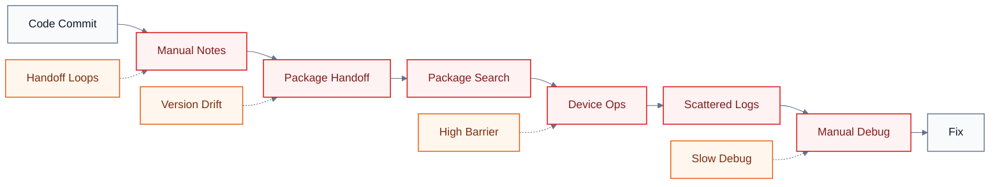
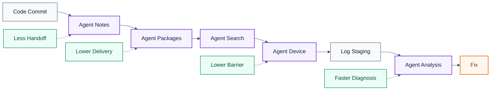

# RavenAI

English | [中文](README.zh.md)

> **RavenAI is a lightweight, enterprise-grade, open-source alternative to Manus — built for teams that need AI agents to understand project context, use tools, operate real systems, and carry work from a request to a verifiable result.**

RavenAI provides an open, self-hostable foundation for building and operating practical AI agents. It brings models, prompts, skills, repositories, enterprise services, and real devices into one extensible workspace, so organizations can keep control of their data and infrastructure while adapting agents to their own workflows.

The platform is lightweight enough to fit into an existing technology stack and structured for enterprise use, with project-level context isolation, credential boundaries, configurable model routing, reusable skills, and traceable execution workspaces. RavenAI is domain-agnostic by design: it began in satellite-communications R&D and testing, but its architecture can support any project and, through customization, agents for engineering, operations, support, and other business roles.

RavenAI is an independent open-source project and is not affiliated with Manus.

This repository is the top-level workspace for two major subprojects:

- `RavenClient`: an Electron-based desktop client built on Cherry Studio, providing MCP device operations, package creation, and AI workflows for developers and testers.
- `RavenAIService`: backend services for log staging, device-link orchestration, AI chat, asynchronous log processing, package management, and intelligent package search.

## Mission

Our mission is to make capable AI agents accessible to every AI builder and enterprise team — not as another chatbot or a closed demo, but as an open platform that can be deployed, understood, extended, and trusted in real work.

RavenAI focuses on four goals:

- **Lightweight adoption**: integrate with existing models, repositories, services, tools, and devices without rebuilding the entire enterprise stack.
- **End-to-end execution**: move beyond conversation by allowing agents to gather context, invoke tools, perform tasks, preserve evidence, and return results.
- **Enterprise-ready foundations**: keep projects, credentials, knowledge, and execution contexts separated and manageable.
- **Open extensibility**: let the community inspect, self-host, customize, and contribute agents, skills, tools, and workflows.

## What RavenAI Solves

R&D and testing is RavenAI's first deeply integrated enterprise scenario. It connects the real workflow into a closed loop:

1. Developers submit code and evolve versions through Git.
2. A lightweight Release Note Agent reads Git history and automatically drafts release notes for package-management refactors.
3. Reconstructed package management supports package creation, upload, metadata extraction, search, and distribution.
4. Testers use natural language to operate test devices through RavenClient, ChatAgent, Device Link, MCP Server, device tools, and Python automation.
5. After testing, logs are submitted to RavenAIService and analyzed by LogAnalysisAgent to produce evidence, issue clues, and feedback for development.

## R&D Testing Flow Comparison

Without Agent participation, the R&D testing flow relies on manual handoffs, manual package lookup, manual device operations, and manual log inspection:



With RavenAI, Agents sit in the key friction points: release notes, package management, package retrieval, device control, and log analysis:



## Architecture Overview

> Open [Docs/raven-architecture.html](Docs/raven-architecture.html) and [Docs/raven-agent-context.html](Docs/raven-agent-context.html) in a browser for the interactive version with dark/light theme toggle and export.

### System Technology Structure



- **Client layer**: `RavenClient`, Electron, React, MCP Client, package tools, DeviceLinkClient.
- **AI orchestration layer**: ChatAgent and LogAnalysisAgent built with the Claude Agent SDK and OpenAI-compatible LLM access.
- **Service layer**: FastAPI services in `RavenAIService`, Express-based `package-server`, and the Electron `update-server`.
- **Communication and tasks**: REST APIs, WebSocket Device Link, Celery, and Redis.
- **Data and knowledge layer**: uploaded packages, package metadata, log archives, database records, and FAISS vector indexes.
- **Device tool layer**: MCP Server, device-interface wrappers, and Python automation scripts for device operation and testing.

Key architectural highlights:
- **Prompt layering**: Agent-level base prompts (`prompts_config.yaml`) merged with Project-level appended prompts (`data/project_prompts/<project_code>/system_prompt.md`) before each run; edits take effect immediately.
- **Skill layering (Claude Agent SDK)**: Agent-level skills (`data/agent_skills/<agent>/store`) and Project-level skills (`data/project_skills/<project_code>/store`) are materialized to `.claude/skills/` before each run.
- **Service ↔ Client reverse tunnel**: Client connects outbound via WebSocket to `Service:8085/ws/device-link`; heartbeat ping/pong with exponential-backoff reconnect; no inbound port required on the device side.
- **Secure repository access**: LogAnalysis / BugFix / ProjectExpert Agents connect to repositories via SSH Key / Token with credential isolation; repositories are cloned as read-only copies.

### Agent Context Layers and Assembly



Context for each Agent run is assembled from two layers before the Agent starts:

- **Agent level (base layer)**: Keyed by agent name; shared across all projects. Prompts from `prompts_config.yaml` (`claude_agent_<name>`, zh/en locale). Skills from `data/agent_skills/<agent>/store` controlled by `_registry.json`.
- **Project level (append layer)**: Isolated by `project_code`; activated when the user selects a project. Prompts from `project_prompts/<code>/system_prompt.md` (edit takes effect immediately). Skills from `project_skills/<code>/store`; same name overrides the Agent-level skill.
- **Pre-run assembly**: Final system prompt = base + project append + reply-language instruction. Skills are materialized to `.claude/skills/` (Agent Skills first; project-level overrides same name). Repository is `git clone`d to `<workspace>/repo/` (reused if `.git` already exists).
- **Workspace `<workspace>/`**: Contains the synthesized `system_prompt`, `.claude/skills/<name>/`, `repo/` (read-only: Read/Grep/Glob/Bash/git), and `task.json + logs/`.

## Repository Layout

```text
RavenAI/
├── RavenClient/                 # Desktop client, package tooling, MCP and device workflows
├── RavenAIService/              # Backend services, log staging, AI analysis, package server
│   ├── app/                     # FastAPI application, agents, services, tasks
│   ├── frontend/                # Web frontend for service-side UI
│   └── package-server/          # Express package management and RAG search service
├── Docs/                        # Project documentation and feature notes
├── .gitmodules                  # Submodule definitions
└── README.md                    # This document
```

## Quick Start

Clone the repository with submodules:

```bash
git clone --recurse-submodules <repo-url>
cd RavenAI
```

If the repository was cloned without submodules:

```bash
git submodule update --init --recursive
```

Start the backend log staging service:

```bash
cd RavenAIService
python3 -m venv venv
source venv/bin/activate
pip install -r requirements.txt
uvicorn app.main:app --host 0.0.0.0 --port 8085 --reload
```

Start the package server:

```bash
cd RavenAIService/package-server
npm install
npm run dev
```

Start the desktop client:

```bash
cd RavenClient
yarn install
yarn dev
```

## Key Services

- RavenAIService API: `http://localhost:8085`
- Package server: `http://localhost:8083/raven`
- Update server: `RavenClient/update-server`
- Desktop client: launched through Electron during `yarn dev`

## Notes

The Release Note Agent mentioned in the workflow is part of the project process: it reads Git commit history and drafts release notes for the package-management refactor. It is included in the architecture description because it completes the R&D testing workflow, even though it is not represented as a full standalone module in this codebase.
