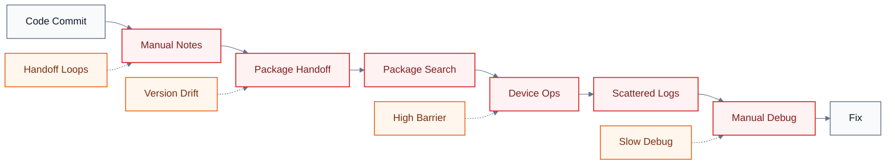
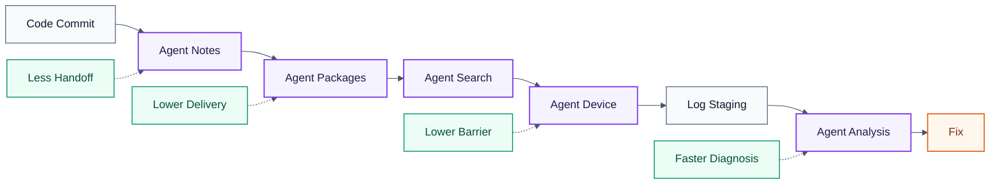
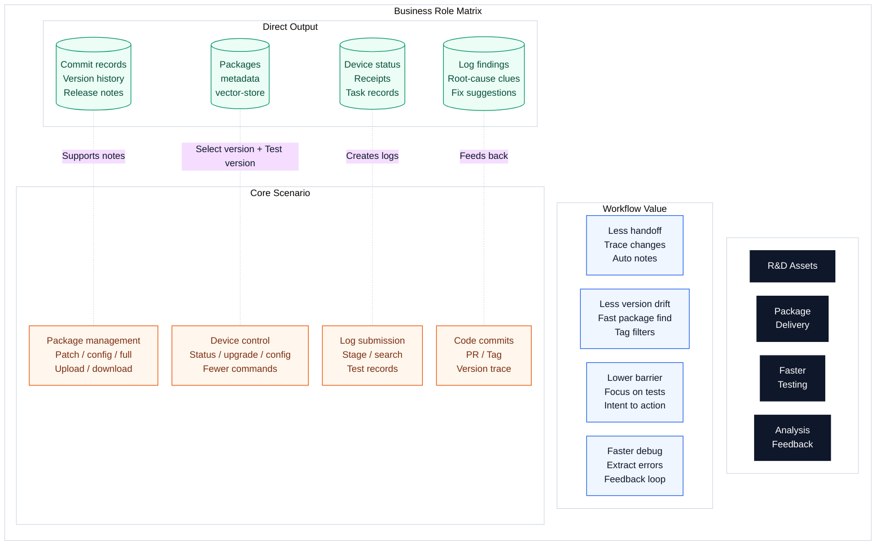
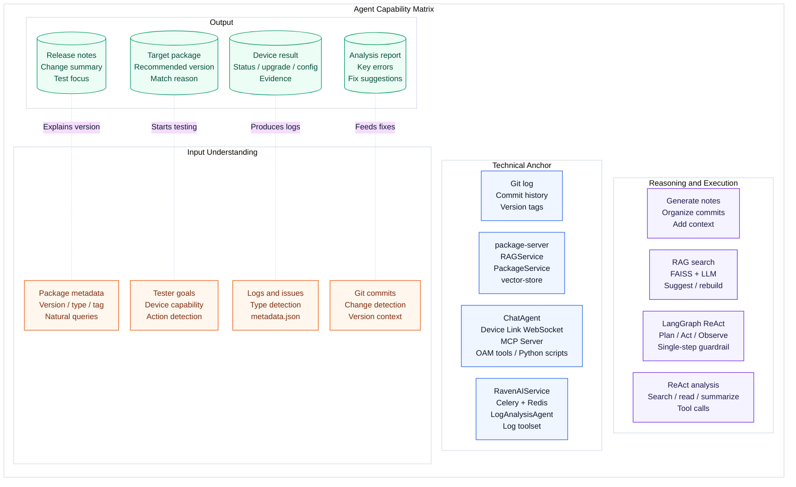

# RavenAI

English | [中文](README.zh.md)

RavenAI is an AI-powered satellite baseband payload development and testing platform. It connects the workflow from engineering commits, release package management, intelligent package retrieval, natural-language device operation, test log submission, and agentic log analysis.

This repository is the top-level workspace for two major subprojects:

- `RavenClient`: an Electron-based desktop client built on Cherry Studio, customized for satellite payload testing, MCP device operations, package creation, and tester-facing AI workflows.
- `RavenAIService`: backend services for log staging, device-link orchestration, AI chat, asynchronous log processing, package management, and intelligent package search.

## What RavenAI Solves

RavenAI is designed around the real R&D testing loop:

1. Developers submit code and evolve versions through Git.
2. A lightweight Release Note Agent reads Git history and automatically drafts release notes for package-management refactors.
3. Reconstructed package management supports package creation, upload, metadata extraction, search, and distribution.
4. Testers use natural language to operate test devices through RavenClient, ChatAgent, Device Link, MCP Server, OAM tools, and Python automation.
5. After testing, logs are submitted to RavenAIService and analyzed by LogAnalysisAgent to produce evidence, issue clues, and feedback for development.

## R&D Testing Flow Comparison

Without Agent participation, the R&D testing flow relies on manual handoffs, manual package lookup, manual device operations, and manual log inspection:



With RavenAI, Agents sit in the key friction points: release notes, package management, package retrieval, device control, and log analysis:



## Business Role Matrix



## Agent Capability Matrix



## Architecture Overview

- **Client layer**: `RavenClient`, Electron, React, MCP Client, package tools, device-link client.
- **AI orchestration layer**: ChatAgent and LogAnalysisAgent built with LangGraph/LangChain and OpenAI-compatible LLM access.
- **Service layer**: FastAPI services in `RavenAIService`, Express-based `package-server`, and the Electron `update-server`.
- **Communication and tasks**: REST APIs, WebSocket Device Link, Celery, and Redis.
- **Data and knowledge layer**: uploaded packages, package metadata, log archives, database records, and FAISS vector indexes.
- **Device tool layer**: MCP Server, OAM interface wrappers, and Python automation scripts for satellite payload testing.

## Repository Layout

```text
RavenAI/
├── RavenClient/                 # Desktop client, package tooling, MCP and device workflows
├── RavenAIService/              # Backend services, log staging, AI analysis, package server
│   ├── app/                     # FastAPI application, agents, services, tasks
│   ├── frontend/                # Web frontend for service-side UI
│   └── package-server/          # Express package management and RAG search service
├── Docs/                        # Project documentation and feature notes
├── .gitmodules                  # Submodule definitions
└── README.md                    # This document
```

## Quick Start

Clone the repository with submodules:

```bash
git clone --recurse-submodules <repo-url>
cd RavenAI
```

If the repository was cloned without submodules:

```bash
git submodule update --init --recursive
```

Start the backend log staging service:

```bash
cd RavenAIService
python3 -m venv venv
source venv/bin/activate
pip install -r requirements.txt
uvicorn app.main:app --host 0.0.0.0 --port 8085 --reload
```

Start the package server:

```bash
cd RavenAIService/package-server
npm install
npm run dev
```

Start the desktop client:

```bash
cd RavenClient
yarn install
yarn dev
```

## Key Services

- RavenAIService API: `http://localhost:8085`
- Package server: `http://localhost:8083/raven`
- Update server: `RavenClient/update-server`
- Desktop client: launched through Electron during `yarn dev`

## Notes

The Release Note Agent mentioned in the workflow is part of the project process: it reads Git commit history and drafts release notes for the package-management refactor. It is included in the architecture description because it completes the R&D testing workflow, even though it is not represented as a full standalone module in this codebase.
