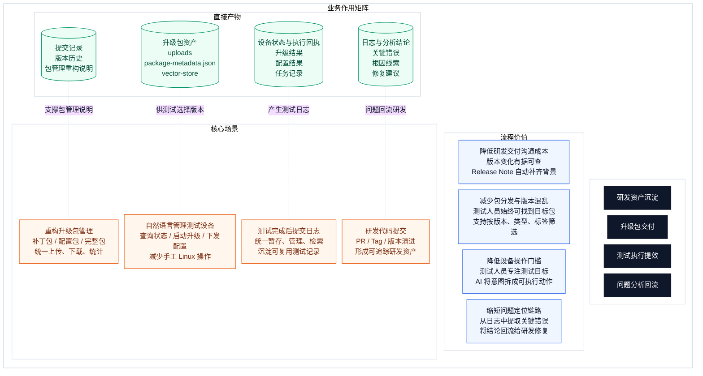
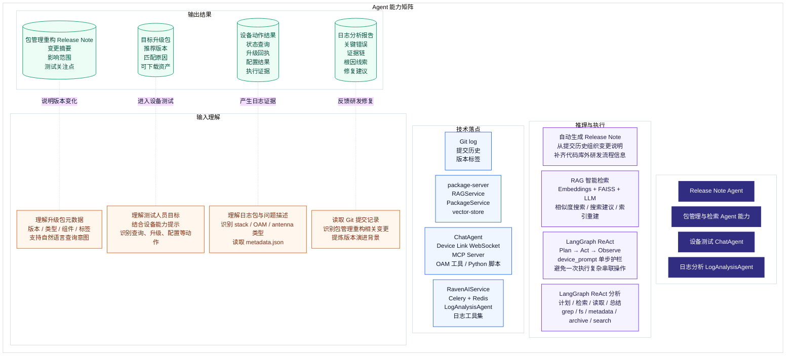

# RavenAI

[English](README.md) | 中文

RavenAI 是面向卫星基带载荷研发测试场景的 AI 平台。它把研发代码提交、升级包管理、智能检索、自然语言设备控制、测试日志提交，以及 Agentic 日志分析串联成一个闭环。

本仓库是顶层工作区，包含两个主要子项目：

- `RavenClient`：基于 Electron 与 Cherry Studio 定制的桌面客户端，面向卫星载荷测试、MCP 设备操作、升级包制作和测试人员 AI 工作流。
- `RavenAIService`：后端服务集合，提供日志暂存、设备联动、AI 对话、异步日志处理、包管理和智能包检索等能力。

## 项目解决的问题

RavenAI 围绕真实研发测试流程设计：

1. 研发人员通过 Git 提交代码并推进版本演进。
2. 简单的 Release Note Agent 读取 Git 提交历史，自动编写包管理重构相关 Release Note。
3. 重构后的包管理能力支持升级包制作、上传、元数据提取、检索和分发。
4. 测试人员通过 RavenClient、ChatAgent、Device Link、MCP Server、OAM 工具和 Python 自动化脚本，用自然语言管理测试设备。
5. 测试完成后，日志提交至 RavenAIService，由 LogAnalysisAgent 分析并产出证据链、问题线索和研发回流建议。

## 业务作用矩阵



## Agent 能力矩阵



## 技术架构概览

- **客户端层**：`RavenClient`、Electron、React、MCP Client、包管理工具、DeviceLinkClient。
- **AI 编排层**：基于 LangGraph/LangChain 的 ChatAgent 与 LogAnalysisAgent，接入 OpenAI-compatible LLM。
- **服务层**：`RavenAIService` 中的 FastAPI 服务、Express `package-server`，以及 Electron `update-server`。
- **通信与任务层**：REST API、WebSocket Device Link、Celery、Redis。
- **数据与知识层**：升级包、包元数据、日志包、数据库记录和 FAISS 向量索引。
- **设备工具层**：MCP Server、OAM 接口封装和面向卫星载荷测试的 Python 自动化脚本。

## 仓库结构

```text
RavenAI/
├── RavenClient/                 # 桌面客户端、包工具、MCP 与设备联动流程
├── RavenAIService/              # 后端服务、日志暂存、AI 分析、包管理服务
│   ├── app/                     # FastAPI 应用、agents、services、tasks
│   ├── frontend/                # 服务侧 Web 前端
│   └── package-server/          # Express 包管理与 RAG 检索服务
├── Docs/                        # 项目文档与功能说明
├── .gitmodules                  # 子模块定义
└── README.md                    # 默认英文说明文档
```

## 快速开始

克隆仓库并拉取子模块：

```bash
git clone --recurse-submodules <repo-url>
cd RavenAI
```

如果克隆时没有包含子模块：

```bash
git submodule update --init --recursive
```

启动日志暂存后端服务：

```bash
cd RavenAIService
python3 -m venv venv
source venv/bin/activate
pip install -r requirements.txt
uvicorn app.main:app --host 0.0.0.0 --port 8085 --reload
```

启动包管理服务：

```bash
cd RavenAIService/package-server
npm install
npm run dev
```

启动桌面客户端：

```bash
cd RavenClient
yarn install
yarn dev
```

## 关键服务

- RavenAIService API：`http://localhost:8085`
- 包管理服务：`http://localhost:8083/raven`
- 更新服务：`RavenClient/update-server`
- 桌面客户端：通过 `yarn dev` 启动 Electron

## 说明

流程中提到的 Release Note Agent 是项目研发流程的一部分：它通过读取 Git 提交历史，自动编写包管理重构相关 Release Note。虽然它不是当前代码库中的完整独立模块，但它补齐了从研发提交到测试交付之间的重要环节，因此在架构说明中保留。
